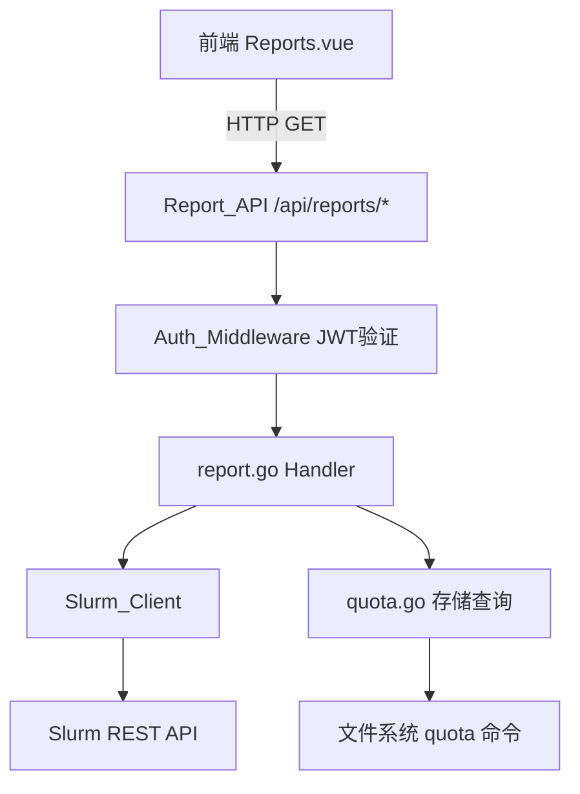

# 设计文档：报表中心（compute-resource-report）

## 概述

报表中心为 HPC 集群管理平台新增算力资源使用情况的可视化报表功能。后端在现有 Slurm 集成和配额接口基础上新增聚合计算逻辑，前端在现有 `Reports.vue` 基础上扩展图表和数据展示能力。

整体设计遵循现有项目架构：
- 后端：Go + Gin，新增 `backend/handlers/report.go`，复用 `Slurm_Client` 和 `quota` 相关逻辑
- 前端：Vue.js + ECharts（项目已引入），扩展 `src/views/Reports.vue`，新增 `src/api/report.ts`

---

## 架构



### 数据流

1. 前端携带 JWT token 发起报表查询请求（含时间范围、队列等参数）
2. `Auth_Middleware` 验证 token，将 `username` 和 `isAdmin` 注入 gin.Context
3. `report.go` Handler 根据 `isAdmin` 决定查询范围（自身 vs 全局）
4. 调用 `Slurm_Client` 获取作业历史数据，调用 `quota` 逻辑获取存储数据
5. 后端聚合计算后返回结构化 JSON，前端渲染图表和表格

---

## 组件与接口

### 后端新增：`backend/handlers/report.go`

新增以下 Handler 函数：

| 函数 | 路由 | 权限 | 说明 |
|------|------|------|------|
| `GetJobStats` | `GET /api/reports/jobs` | 所有登录用户 | 作业统计（数量、等待时间、规模分布） |
| `GetUsageStats` | `GET /api/reports/usage` | 所有登录用户 | 卡时/核时使用量及比例 |
| `GetStorageStats` | `GET /api/reports/storage` | 所有登录用户 | 存储用量 |
| `GetQuotaStats` | `GET /api/reports/quota` | 所有登录用户 | 用户配额情况 |

**通用查询参数：**
- `start_time`：开始时间（Unix 时间戳或 `YYYY-MM-DD`）
- `end_time`：结束时间（Unix 时间戳或 `YYYY-MM-DD`）
- `partition`：队列名称（可选，不传则查全部）
- `user`：目标用户名（仅管理员有效，普通用户忽略此参数）

### 路由注册（main.go 新增）

```go
reports := auth.Group("/reports")
{
    reports.GET("/jobs",    handlers.GetJobStats)
    reports.GET("/usage",   handlers.GetUsageStats)
    reports.GET("/storage", handlers.GetStorageStats)
    reports.GET("/quota",   handlers.GetQuotaStats)
}
```

### 前端新增：`src/api/report.ts`

```typescript
export const reportAPI = {
  getJobStats:     (params) => axios.get('/reports/jobs',    { params }),
  getUsageStats:   (params) => axios.get('/reports/usage',   { params }),
  getStorageStats: (params) => axios.get('/reports/storage', { params }),
  getQuotaStats:   (params) => axios.get('/reports/quota',   { params }),
}
```

---

## 数据模型

### 后端响应结构

#### `GET /api/reports/jobs` 响应

```json
{
  "data": {
    "monthly_job_counts": [
      { "month": "2024-01", "partition": "gpu", "count": 42 },
      { "month": "2024-01", "partition": "cpu", "count": 128 }
    ],
    "avg_wait_time_minutes": 15.3,
    "job_scale_distribution": [
      { "range": "1-4核",   "count": 80 },
      { "range": "5-16核",  "count": 60 },
      { "range": "17-64核", "count": 30 },
      { "range": "64核以上", "count": 10 }
    ],
    "total_jobs": 180
  }
}
```

#### `GET /api/reports/usage` 响应

```json
{
  "data": {
    "gpu_hours": 1024.5,
    "cpu_hours": 8192.0,
    "billing_hours": 8192.0,
    "quota_billing_hours": 10000.0,
    "usage_percent": 81.92,
    "status": "WARNING"
  }
}
```

#### `GET /api/reports/storage` 响应

```json
{
  "data": [
    {
      "username": "alice",
      "filesystem": "/home",
      "used_gb": 45.2,
      "soft_limit_gb": 100.0,
      "hard_limit_gb": 120.0,
      "usage_percent": 45.2,
      "over_soft_limit": false
    }
  ]
}
```

#### `GET /api/reports/quota` 响应

```json
{
  "data": {
    "account": "research",
    "total_billing_hours": 10000.0,
    "used_billing_hours": 8192.0,
    "remaining_billing_hours": 1808.0,
    "usage_percent": 81.92,
    "status": "WARNING"
  }
}
```

### 前端内部状态（Reports.vue）

```typescript
interface ReportFilters {
  startDate: string      // YYYY-MM-DD
  endDate: string        // YYYY-MM-DD
  partition: string      // '' 表示全部
  reportType: 'jobs' | 'usage' | 'storage' | 'quota'
}
```

---

## 正确性属性

*属性（Property）是在系统所有有效执行中都应成立的特征或行为——本质上是对系统应做什么的形式化陈述。属性是人类可读规范与机器可验证正确性保证之间的桥梁。*

### 属性 1：普通用户权限隔离

*对于任意*普通用户（isAdmin=false）发起的报表查询，无论请求参数中是否包含 `user` 字段或传入其他用户名，返回的所有作业记录中 `user` 字段均应等于当前登录用户名。

**验证：需求 1.4、2.3、3.2、7.1、7.3**

### 属性 2：管理员可查询指定用户数据

*对于任意*管理员（isAdmin=true）发起的报表查询，当请求参数中指定 `user=X` 时，返回的所有作业记录均应属于用户 X。

**验证：需求 1.5、2.4、3.3、4.5、7.2**

### 属性 3：配额使用率计算与状态分类正确性

*对于任意* `total > 0` 的配额数据，`usage_percent = used / total * 100`，且 `status` 字段应满足：
- `used / total < 0.8` → `"NORMAL"`
- `0.8 ≤ used / total < 1.0` → `"WARNING"`
- `used / total ≥ 1.0` → `"EXCEEDED"`

**验证：需求 2.2、4.3、4.4**

### 属性 4：队列过滤一致性

*对于任意*指定了 `partition=P` 的作业统计查询，返回的所有作业记录的 `partition` 字段均应等于 P。

**验证：需求 5.4**

### 属性 5：空数据返回 200 而非错误

*对于任意*时间范围内无作业数据的查询，Report_API 应返回 HTTP 200 及空数组/零值结构，而非 4xx/5xx 错误码。

**验证：需求 1.6、4.6**

### 属性 6：存储超软限制标记一致性

*对于任意*存储配额记录，当 `block_soft_kb > 0` 时，`over_soft_limit` 字段应等于 `used_kb > block_soft_kb`。

**验证：需求 3.4**

### 属性 7：聚合统计分组之和等于总数

*对于任意*作业列表，`monthly_job_counts` 中所有月份的 `count` 之和应等于 `total_jobs`；`job_scale_distribution` 中所有分组的 `count` 之和也应等于 `total_jobs`。

**验证：需求 1.1、1.3**

### 属性 8：平均等待时间计算正确性

*对于任意*包含 N 条作业记录的列表（N > 0），`avg_wait_time_minutes` 应等于所有记录的 `(start_time - submit_time)` 之和除以 N 再除以 60。

**验证：需求 1.2**

### 属性 9：CSV 导出 round-trip 一致性

*对于任意*报表数据集，将其导出为 CSV 后再解析回来，所有数值字段应与原始数据等价（数值精度在合理范围内）。

**验证：需求 6.2**

### 属性 10：日期范围校验

*对于任意* `start_date > end_date` 的输入，前端日期校验函数应返回无效（false），阻止查询请求发出。

**验证：需求 5.5**

---

## 错误处理

| 场景 | HTTP 状态码 | 响应体 |
|------|------------|--------|
| 未携带 JWT token | 401 | `{"error": "Authorization header required"}` |
| Slurm API 不可用 | 500 | `{"error": "无法连接到 Slurm API: ..."}` |
| 存储系统不可用 | 500 | `{"error": "存储配额查询失败: ..."}` |
| 时间参数格式错误 | 400 | `{"error": "invalid start_time format"}` |
| 无数据（正常情况） | 200 | `{"data": {...}}` 含空数组/零值 |

前端错误处理：
- 网络/服务器错误：展示错误提示横幅，不清空已有数据
- 参数校验错误（如开始日期 > 结束日期）：前端本地校验，阻止请求发出

---

## 测试策略

### 单元测试（Go）

针对以下纯函数编写单元测试：
- `aggregateJobStats(records []UsageRecord, partition string) JobStatsResult`：验证聚合逻辑
- `calcUsageStatus(used, total float64) string`：验证状态判断逻辑（边界值：79.9%、80%、99.9%、100%）
- `buildMonthlyJobCounts(records []UsageRecord) []MonthlyCount`：验证月度分组逻辑

### 属性测试（Go，使用 `gopter`）

推荐使用 `gopter` 库进行属性测试，每个属性测试至少运行 100 次随机输入。

每个属性测试需在注释中标注对应属性编号，格式：
`// Feature: compute-resource-report, Property N: <属性描述>`

**属性 3 测试示例：**
```go
// Feature: compute-resource-report, Property 3: 配额使用率计算与状态分类正确性
func TestQuotaStatusProperty(t *testing.T) {
    // 对任意 used ∈ [0, total*2]，验证 usage_percent 和 status 分类正确
}
```

**属性 6 测试示例：**
```go
// Feature: compute-resource-report, Property 6: 存储超软限制标记一致性
func TestStorageOverSoftLimitProperty(t *testing.T) {
    // 对任意 used_kb 和 block_soft_kb > 0，验证 over_soft_limit = (used_kb > block_soft_kb)
}
```

**属性 7 测试示例：**
```go
// Feature: compute-resource-report, Property 7: 聚合统计分组之和等于总数
func TestAggregationSumProperty(t *testing.T) {
    // 对任意作业列表，验证月度 count 之和 == total_jobs，规模分布 count 之和 == total_jobs
}
```

**属性 8 测试示例：**
```go
// Feature: compute-resource-report, Property 8: 平均等待时间计算正确性
func TestAvgWaitTimeProperty(t *testing.T) {
    // 对任意非空作业列表，验证 avg_wait_time_minutes == sum(start-submit)/N/60
}
```

### 集成测试

- 使用 `DEV_MODE=true` 模拟 Slurm 数据，验证权限隔离（属性 1、2）
- 验证队列过滤（属性 4）
- 验证空数据场景（属性 5）

### 前端测试

- 验证日期范围校验逻辑（属性 10：开始日期 > 结束日期时阻止查询）
- 验证 CSV 导出 round-trip（属性 9）
- 验证配额进度条颜色随 `status` 字段变化（属性 3 的 UI 体现）
